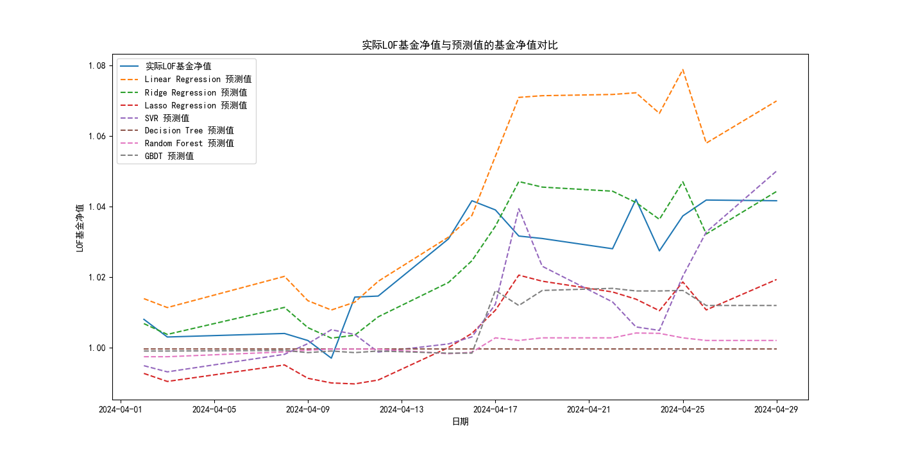

## 首先比较不同机器学习模型拟合的差异

1. **第一轮发现均出现过拟合**
2. **采用正则化和5元交叉验证后重新拟合得到下图**

## 然后采用拟合最好的Ridge 回归模型进行回测，具体步骤如下：

1. **加载和预处理数据**：从多个 Excel 文件中加载指数和基金净值数据，将日期列转换为 datetime 类型并设置为索引。过滤每天9:30到14:00之间的数据，并重命名列以包含指数名称。合并所有指数数据，并按日期重新采样，获取每天的最后一条记录。

2. **创建特征和目标变量**：定义特征变量（指数的收盘价），并创建目标变量为 T+2 日期的基金净值。将数据进行对齐并合并，去除无效的目标变量。

3. **划分训练集和测试集**：将数据划分为80%的训练集和20%的测试集，使用 `StandardScaler` 对特征值进行标准化。

4. **拟合 Ridge 回归模型**：训练 Ridge 回归模型并进行预测，计算和打印模型在训练集和测试集上的均方误差（MSE）和决定系数（R²）。

5. **预测 T+2 日期的基金净值**：创建预测 DataFrame，保留原始索引，计算 T+2 日期的基金净值预测值，并将结果与实际净值进行比较。

6. **制定交易策略**：根据预测结果和实际净值制定交易策略，记录每日的现金、持股和资产总值，计算最终资产总值和收益率。

7. **绘制图表**：绘制资产总值变化图、累计收益曲线和每日盈亏曲线，以可视化交易策略的效果。

8. **回测结果分析**：计算策略的年化收益率、夏普比率、最大回撤和胜率，分析策略的优劣势和改进空间。

* 初始资金: 100000, 最终资产: 103299.99999999999, 收益率: 3.30%
* 年化收益率: 57.54%
* 夏普比率: 3.81
* 最大回撤: -1.54%
* 胜率: 0.00%
